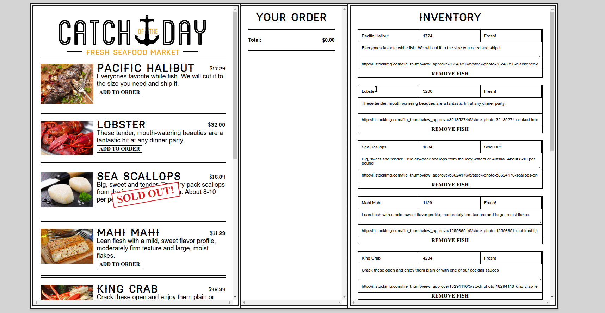

# My first react app

*It is a real-time app for a seafood market where price and quantity available are variable and can change at a moment's notice.*

*Authorized users can update product details and build a menu.*

## Showcase

## Content

* How to build an entire App or Website Component in React.js from start to finish.
* Working with create-react-app for Webpack Tooling
* Understanding React Components and writing markup with JSX
* Maintain your Application's State
* Communication between components
* Working with State and HTML5 LocalStorage
* Real time web socket data with Firebase
* Creating maintainable code with JavaScript Modules
* URL routing with React Router 4
* Taking advantage of new ES6 Features
* Deploying React Applications

<!-- ## Test locally

Run the following in your terminal:

1. Clone repo locally
1. cd catch-of-the-day
2. npm install
3. npm start -->

